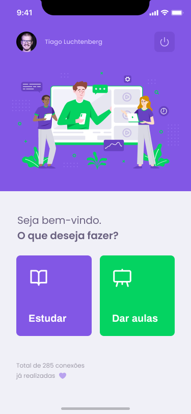

<p align="center">
  
    
   
   <a href="https://github.com/tgmarinho/README-ecoleta/stargazers">
    
  </a>

  <a href="https://www.abnermachado.com">
    
  </a>
  
</p>
<h1 align="center">
    
</h1>

<h4 align="center"> 
	🚧  Proffy 🚀 Em desenvolvimento  🚧
</h4>

<p align="center">
 <a href="#-sobre-o-projeto">Sobre</a> •
 <a href="#-funcionalidades">Funcionalidades</a> •
 <a href="#-layout">Layout</a> • 
 <a href="#-como-executar-o-projeto">Como executar</a> • 
 <a href="#-tecnologias">Tecnologias</a> • 
 <a href="#-contribuidores">Contribuidores</a> • 
 <a href="#-autor">Autor</a> • 
 <a href="#user-content--licença">Licença</a>
</p>


## 💻 Sobre o projeto

♻️ Proffy - É uma forma de conectar alunos e professores, onde os professores podem divulgar suas aulas, horários disponíveis e preço/hora, e os alunos podem buscar por aulas, filtrando a matéria, dia da semana e horário de preferência para a aula.


Projeto desenvolvido durante a **NLW - Next Level Week #2** oferecida pela [Rocketseat](https://rocketseat.com.br).
O NLW é uma experiência online com muito conteúdo prático, desafios e hacks onde o conteúdo fica disponível durante uma semana.

---

## ⚙️ Funcionalidades

- [x] Professores podem cadastrar as suas aulas:
    - [x] Matéria da aula
    - [x] Horários disponíveis para a aula
    - [x] Preço/hora
    - [x] Whatsapp
- [x] Listagem de professores
- [x] Alunos podem buscar por aulas cadastradas
- [x] O aluno pode entrar em contato com o professor através do WhatsApp

---

## 🎨 Layout

O layout da aplicação está disponível no Figma:

<a href="https://www.figma.com/file/GHGS126t7WYjnPZdRKChJF/?viewer=1&node-id=">
  
</a>
<a href="https://www.figma.com/file/e33KvgUpFdunXxJjHnK7CG/Proffy-Mobile">
  
</a>


### Mobile

<p align="center">
  

  
</p>

### Web

<p align="center" style="display: flex; align-items: flex-start; justify-content: center;">
  

  
</p>

---

## 🚀 Como executar o projeto

Este projeto é divido em três partes:
1. Backend (pasta server) 
2. Frontend (pasta web)
3. Mobile (pasta mobile)

💡Tanto o Frontend quanto o Mobile precisam que o Backend esteja sendo executado para funcionar.

### Pré-requisitos

Antes de começar, você vai precisar ter instalado em sua máquina as seguintes ferramentas:
[Git](https://git-scm.com), [Node.js](https://nodejs.org/en/), [Yarn](https://yarnpkg.com/) ou [Npm](https://www.npmjs.com/). 
Além disto é bom ter um editor para trabalhar com o código como [VSCode](https://code.visualstudio.com/)

#### 🎲 Rodando o Backend (servidor)

```bash

# Clone este repositório
$ git clone https://github.com/abner81/NextLevelWeek-Proffy-NWL.git

# Acesse a pasta do projeto no terminal/cmd
$ cd NextLevelWeek-Proffy-NWL

# Vá para a pasta server
$ cd server

# Instale as dependências
$ yarn install ou npm install

# Execute a aplicação em modo de desenvolvimento
$ yarn start ou npm start

# O servidor inciará na porta:3333 - acesse http://localhost:3333 

```
<p align="center">
  <a href="https://github.com/tgmarinho/README-ecoleta/blob/master/Insomnia_API_Ecoletajson.json" target="_blank"></a>
</p>


#### 🧭 Rodando a aplicação web (Frontend)

```bash

# Vá para a pasta da aplicação Front End
$ cd web

# Instale as dependências
$ yarn install ou npm install

# Execute a aplicação em modo de desenvolvimento
$ yarn ou npm start

# A aplicação será aberta na porta:3000 - acesse http://localhost:3000

```

---

## 🛠 Tecnologias

As seguintes ferramentas foram usadas na construção do projeto:

#### **Website**  ([React](https://reactjs.org/)  +  [TypeScript](https://www.typescriptlang.org/))

-   **[React Router Dom](https://github.com/ReactTraining/react-router/tree/master/packages/react-router-dom)**
-   **[Axios](https://github.com/axios/axios)**

> Veja o arquivo  [package.json](https://github.com/abner81/NextLevelWeek-Proffy-NWL/blob/master/web/package.json)

#### [](https://github.com/abner81/NextLevelWeek-Proffy-NWL/tree/master/server)**Server**  ([NodeJS](https://nodejs.org/en/)  +  [TypeScript](https://www.typescriptlang.org/))

-   **[Express](https://expressjs.com/)**
-   **[CORS](https://expressjs.com/en/resources/middleware/cors.html)**
-   **[KnexJS](http://knexjs.org/)**
-   **[SQLite](https://github.com/mapbox/node-sqlite3)**
-   **[ts-node](https://github.com/TypeStrong/ts-node)**
-   **[dotENV](https://github.com/motdotla/dotenv)**

> Veja o arquivo  [package.json](https://github.com/abner81/NextLevelWeek-Proffy-NWL/blob/master/server/package.json)

#### [](https://github.com/abner81/Mobile-Nwl-Proffy/tree/cc998941133880f08f0381650068e4582c4b1cb6)**Mobile**  ([React Native](http://www.reactnative.com/)  +  [TypeScript](https://www.typescriptlang.org/))

-   **[Expo](https://expo.io/)**
-   **[Expo Google Fonts](https://github.com/expo/google-fonts)**
-   **[React Navigation](https://reactnavigation.org/)**
-   **[Axios](https://github.com/axios/axios)**

> Veja o arquivo  [package.json](https://github.com/abner81/Mobile-Nwl-Proffy/blob/cc998941133880f08f0381650068e4582c4b1cb6/package.json)

#### [](https://github.com/tgmarinho/Ecoleta#utilit%C3%A1rios)**Utilitários**

-   Editor:  **[Visual Studio Code](https://code.visualstudio.com/)**  → Extensions:  **[SQLite](https://marketplace.visualstudio.com/items?itemName=alexcvzz.vscode-sqlite)**
-   Markdown:  **[StackEdit](https://stackedit.io/)**,  **[Markdown Emoji](https://gist.github.com/rxaviers/7360908)**
-   Commit Conventional:  **[Commitlint](https://github.com/conventional-changelog/commitlint)**
-   Teste de API:  **[Insomnia](https://insomnia.rest/)**
-   Ícones:  **[Feather Icons](https://feathericons.com/)**,  **[Font Awesome](https://fontawesome.com/)**

---

## 💪 Como contribuir para o projeto

1. Faça um **fork** do projeto.
2. Crie uma nova branch com as suas alterações: `git checkout -b my-feature`
3. Salve as alterações e crie uma mensagem de commit contando o que você fez: `git commit -m "feature: My new feature"`
4. Envie as suas alterações: `git push origin my-feature`
> Caso tenha alguma dúvida confira este [guia de como contribuir no GitHub](./CONTRIBUTING.md)

---

## 🦸 Autor

<a href="https:abnermachado.com">
 
 <br />
 <sub><b>Abner Machado</b></sub></a> <a href="https:abnermachado.com" title="Abner Machado">🚀</a>
 <br /> 

---

## 📝 Licença

Este projeto esta sobe a licença [MIT](./LICENSE).

Feito com ❤️ por Abner Machado 👋🏽 [Entre em contato!](https://www.linkedin.com/in/abnerdev/)

---